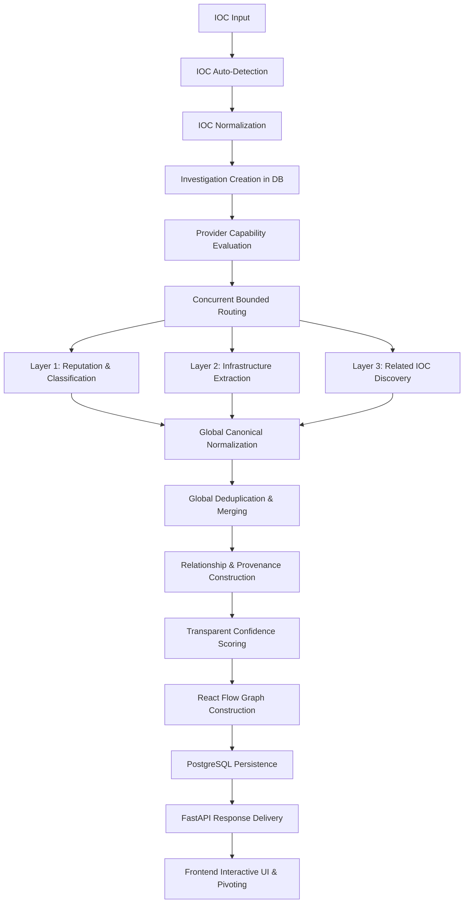

# ThreatLens — Threat Intelligence & Infrastructure Hunting Platform

[](https://fastapi.tiangolo.com)
[](https://reactjs.org/)
[](https://www.typescriptlang.org/)
[](https://www.postgresql.org/)
[](https://alembic.sqlalchemy.org/)
[](https://www.docker.com/)

**ThreatLens** is a Threat Intelligence and Infrastructure Hunting platform engineered for SOC analysts and threat hunters. It takes **ONE Indicator of Compromise (IOC)** as input and automatically executes a comprehensive 19-stage pipeline from identification to multi-provider capability routing, reputation analysis, infrastructure extraction, deduplication, and recursive pivoting.

---

## Table of Contents

- [Key Features](#key-features)
- [Supported IOC Types](#supported-ioc-types)
- [Investigation Pipeline](#investigation-pipeline)
- [Provider Capability Matrix](#provider-capability-matrix)
- [System Architecture](#system-architecture)
- [Installation & Setup](#installation--setup)
  - [Recommended: Docker](#recommended-docker)
    - [Prerequisites](#prerequisites)
    - [Clone Repository](#clone-repository)
    - [Configure Environment](#configure-environment)
    - [Start ThreatLens](#start-threatlens)
    - [Access ThreatLens](#access-threatlens)
    - [Stop ThreatLens](#stop-threatlens)
  - [Development Without Docker (Optional)](#development-without-docker-optional)
    - [1. Backend Setup](#1-backend-setup)
    - [2. Frontend Setup](#2-frontend-setup)
- [Running Tests](#running-tests)
- [The Recursive Pivot Engine](#the-recursive-pivot-engine)
- [Layer Breakdown](#layer-breakdown)
  - [Layer 1: Threat Intelligence & Reputation](#layer-1-threat-intelligence--reputation)
  - [Layer 2: Infrastructure Hunting](#layer-2-infrastructure-hunting)
  - [Layer 3: Related IOC Discovery (Tri-Bucket)](#layer-3-related-ioc-discovery-tri-bucket)
- [Interactive Threat Graph](#interactive-threat-graph)
- [Security Considerations](#security-considerations)
- [Documentation Index](#documentation-index)

---

## Key Features

- **Single IOC Input**: Simply enter any IPv4, IPv6, Domain, URL, MD5, SHA1, or SHA256. ThreatLens detects and normalizes the input automatically.
- **11 Verified Threat Intelligence Providers**: Full adapters for VirusTotal, AlienVault OTX, MalwareBazaar, Hybrid Analysis, AbuseIPDB, ThreatFox, URLhaus, urlscan.io, Censys, GreyNoise (v3), and Shodan.
- **Honest Capability Routing**: Providers only query supported IOC types. Missing credentials safely return `not_configured` without crashing the investigation.
- **Mock Provider Mode**: Immediate out-of-the-box evaluation using deterministic fixtures (`PROVIDER_MODE=mock`) without requiring external API keys.
- **Global Normalization & Deduplication**: Discovered IOCs and relationships reported across multiple providers are merged into single canonical nodes while preserving multi-source provenance.
- **Transparent Confidence Scoring**: Multi-factor scoring model based on provider weighting, corroboration bonuses, and relationship directness.
- **Recursive Pivot Engine**: Traverses graph relationships with strict guardrails against infinite loops, cycles, node explosion, and request budget exhaustion.
- **Interactive React Flow Graph**: Force-directed/circular SOC graph visualization with interactive node inspection and one-click recursive pivoting.
- **Dual SOC Theme**: Professional high-contrast dark theme by default with light theme toggle and localStorage persistence.
- **Persistent Investigation History**: PostgreSQL + SQLAlchemy async storage with Alembic migrations.

---

## Supported IOC Types

ThreatLens requires no manual type selection. It detects and normalizes:

| IOC Type | Canonical Normalization Example | Primary Provider Coverage |
| :--- | :--- | :--- |
| **IPv4** | Canonical dotted quad (`192.168.01.01` -> `192.168.1.1`) | VT, OTX, AbuseIPDB, Shodan, Censys, GreyNoise, urlscan, ThreatFox |
| **IPv6** | RFC 5952 compressed lowercase (`2001:0db8::0042` -> `2001:db8::42`) | VT, OTX, AbuseIPDB, Censys, Shodan, ThreatFox |
| **Domain** | Lowercase, trailing dot stripped, protocol stripped | VT, OTX, Shodan, Censys, urlscan, ThreatFox, Hybrid Analysis |
| **URL** | Lowercase scheme/host, normalized path, intact query parameters | VT, OTX, urlscan, URLhaus, ThreatFox |
| **MD5** | 32-char lowercase hex | VT, OTX, MalwareBazaar, Hybrid Analysis, URLhaus, ThreatFox |
| **SHA1** | 40-char lowercase hex | VT, OTX, MalwareBazaar, Hybrid Analysis, ThreatFox |
| **SHA256** | 64-char lowercase hex | VT, OTX, MalwareBazaar, Hybrid Analysis, URLhaus, ThreatFox, Censys (cert), urlscan |

---

## Investigation Pipeline

Every hunt progresses through the complete 19-stage pipeline:



---

## Provider Capability Matrix

All 11 adapters implement verified official API endpoints and honest capability boundaries:

| Provider | Supported IOCs | Free Tier / Limits | Auth Method | Capabilities |
| :--- | :--- | :--- | :--- | :--- |
| **VirusTotal** | IP, Domain, URL, Hashes | 4 req/min, 500 req/day | Header: `x-apikey` | Multi-engine AV, Passive DNS, Routing ASN, WHOIS |
| **AlienVault OTX** | IP, Domain, URL, Hashes | 10,000 req/hr | Header: `X-OTX-API-KEY` | Threat Pulses, Adversary attribution, Passive DNS |
| **MalwareBazaar** | MD5, SHA1, SHA256 (Hashes Only) | Open Community | Header: `Auth-Key` | Sample metadata, Signatures, Cross-hash pivots |
| **Hybrid Analysis** | Hashes, Domain, IPv4 | ~200 req/hr | Headers: `api-key`, `User-Agent` | Falcon Sandbox score, Contacted IPs/Domains, MITRE |
| **AbuseIPDB** | IPv4, IPv6 (IPs Only) | 1,000 req/day | Header: `Key` | Abuse confidence score, Total reports, Hostnames |
| **ThreatFox** | IP, Domain, URL, Hashes | Open Community | Header: `Auth-Key` | Malware attribution, C2 indicators, Tags |
| **URLhaus** | URL, Domain, IPv4, Hashes | Open Community | Header: `Auth-Key` | Malware distribution URLs, Payloads, Host IP |
| **urlscan.io** | Domain, IP, URL, SHA256 | 100 searches/day | Header: `API-Key` | DOM snapshot, Screenshot, Certificates, Redirects |
| **Censys** | IPv4, IPv6, Domain, SHA256 | 250 queries/month | Basic Auth (ID + Secret) | Open ports, Banners, TLS certs, AS routing |
| **GreyNoise** | IPv4 Only (API v3) | 10,000 lookups/week | Header: `key` | Noise vs. RIOT, Scanner actor attribution, CVEs |
| **Shodan** | IPv4, IPv6, Domain | 1 req/sec | Param: `key` | Ports, Banners, Software versions, CVE vulns |

For in-depth capability documentation, refer to [`docs/PROVIDER_CAPABILITIES.md`](docs/PROVIDER_CAPABILITIES.md).

---

## Installation & Setup

### Recommended: Docker

Docker is the **primary and recommended** method to run ThreatLens. With Docker, the entire multi-tier stack (PostgreSQL database, FastAPI backend, and React/Nginx frontend) is built and orchestrated in isolated containers.

> [!NOTE]
> When running with Docker, you **do not** need to manually install Python, pip, Node.js, npm, or PostgreSQL on your host system. Backend dependencies (`requirements.txt`), frontend dependencies (`package.json`), and database schema initialization are handled automatically during the container build and startup process.

#### Prerequisites

To run ThreatLens using Docker, you only need:
- **Git** ([Download Git](https://git-scm.com/))
- **Docker Desktop** (Windows / macOS) or **Docker Engine with Docker Compose v2** (Linux) ([Get Docker](https://docs.docker.com/get-docker/))
- *(Optional)* Provider API keys if you intend to run in `live` mode (not required for `mock` mode)

#### Clone Repository

```bash
git clone https://github.com/ahmedel-bar/ThreatLens.git
cd ThreatLens
```

#### Configure Environment

Create your environment configuration file from the provided template:

**Linux / macOS:**
```bash
cp .env.example .env
```

**Windows (PowerShell):**
```powershell
Copy-Item .env.example .env
```

Open `.env` in your text editor. ThreatLens supports two operational modes:

1. **Mock Mode (Default — Zero Keys Required):**
   ```ini
   PROVIDER_MODE=mock
   ```
   Runs with realistic, deterministic offline fixtures for all 13 providers. Ideal for testing, evaluation, development, and offline demonstrations.

2. **Live Mode (Real-time Threat Intelligence):**
   ```ini
   PROVIDER_MODE=live
   ```
   Populate the API keys for the providers you wish to query in real time (e.g., `VT_API_KEY`, `OTX_API_KEY`, `SHODAN_API_KEY`, etc.). Providers without keys will gracefully skip during capability routing.

#### Start ThreatLens

Build and start all services with a single command:

**Foreground (view logs):**
```bash
docker compose up --build
```

**Background (detached mode):**
```bash
docker compose up --build -d
```

Docker Compose launches three orchestrated services:
- **`postgres`** (`postgres:16-alpine`): Relational datastore with persistent volume `postgres_data`.
- **`backend`** (Python 3.12 / FastAPI / Uvicorn): Core intelligence engine, provider adapters, and REST API.
- **`frontend`** (React 19 / Vite / Nginx): Responsive analyst interface served via high-performance Nginx.

#### Access ThreatLens

Once the containers are healthy, access the services:

| Service | URL | Description |
|---|---|---|
| **Web UI** | `http://localhost` or `http://localhost:3000` | Interactive SOC analyst investigation dashboard |
| **Backend API** | `http://localhost:8000` | FastAPI REST API root |
| **Interactive API Docs** | `http://localhost:8000/docs` | Interactive Swagger UI / OpenAPI documentation |
| **Alternative API Docs** | `http://localhost:8000/redoc` | ReDoc API documentation |
| **Health Check** | `http://localhost:8000/api/v1/health` | Service health status endpoint |
| **PostgreSQL Database** | `localhost:5432` | Relational storage (credentials defined in `.env`) |

#### Stop ThreatLens

To stop the running containers:

```bash
docker compose down
```

To stop containers **and remove the persistent PostgreSQL volume** (resetting the database to a clean state):

```bash
docker compose down -v
```

---

### Development Without Docker (Optional)

This setup is intended **only** for developers or contributors actively modifying backend or frontend code outside containers. It requires installing and managing host dependencies manually.

**Host Prerequisites:**
- Python 3.11+ (tested on Python 3.12 and 3.14)
- Node.js 18+ and npm
- PostgreSQL 16 running locally (or SQLite for quick testing by overriding `DATABASE_URL`)

#### 1. Backend Setup

```bash
# Navigate to backend directory
cd backend

# Create and activate virtual environment
# Linux / macOS:
python3 -m venv .venv
source .venv/bin/activate

# Windows (PowerShell):
python -m venv .venv
.venv\Scripts\Activate.ps1

# Install backend dependencies
pip install -r requirements.txt

# Run database migrations (from backend directory)
alembic upgrade head

# Start FastAPI development server with auto-reload
uvicorn app.main:app --reload --port 8000
```

The API will be available at `http://localhost:8000` and interactive docs at `http://localhost:8000/docs`.

#### 2. Frontend Setup

In a separate terminal:

```bash
# Navigate to frontend directory
cd frontend

# Install frontend dependencies
npm install

# Start Vite development server
npm run dev
```

The frontend development server will start at `http://localhost:5173`.

---

## Running Tests

ThreatLens includes a comprehensive automated test suite covering IOC detection, normalization, provider parsing, capability routing, global deduplication, recursive pivoting, and API integration:

```bash
# From workspace root
backend/.venv/Scripts/pytest backend/tests -v
```

To verify the frontend TypeScript and production bundle:

```bash
cd frontend
npm run build
```

---

## The Recursive Pivot Engine

One of ThreatLens's core capabilities is the **Recursive Pivot Engine** located in `app/services/pivot.py`. When a SOC analyst pivots on an IOC (e.g. from an IP to a Certificate SAN, or from a URL to a downloaded malware hash), the engine:

1. Evaluates provider capabilities for the target node.
2. Traverses and queries providers with bounded concurrency.
3. Applies strict safety limits to prevent runaway queries:
   - `MAX_PIVOT_DEPTH`: Max traversal depth (default: 2)
   - `MAX_PIVOT_NODES`: Max nodes per investigation (default: 25)
   - `MAX_PROVIDER_REQUESTS`: Max total queries allowed (default: 40)
4. Enforces **Visited-Node Protection** and **Cycle Prevention**: Already visited nodes are tracked in-memory and in DB pivot runs; cyclical loops (e.g. `Domain A -> IP B -> Domain A`) are strictly terminated.

---

## Layer Breakdown

### Layer 1: Threat Intelligence & Reputation
Summarizes threat classifications across all queried providers. Shows detection metrics (malicious, suspicious, clean counts), threat actor attribution, malware families, and expandable raw evidence.

### Layer 2: Infrastructure Hunting
Consolidates infrastructure telemetry into structured hunting cards:
- Routing & ASN (AS Number, AS Owner, CIDR, Reverse DNS)
- Physical Geolocation (Country, City, Region)
- Domain Registration (Registrar, Created, Expires, Nameservers)
- DNS Zone Records (A, AAAA, MX, NS, TXT)
- Open Ports & Running Services (Port list, service banners)
- SSL/TLS Certificates (Fingerprints, Subject Common Names, SANs)
- Web Telemetry (HTTP server banner, HTML title, Screenshot preview)

### Layer 3: Related IOC Discovery (Tri-Bucket)
Strictly partitioned into three primary hunting buckets:
1. **Hashes** (MD5, SHA1, SHA256)
2. **IPs** (IPv4, IPv6)
3. **URLs & Domains**

Each row features canonical values, relation types, contributing providers, confidence scores, and an actionable **[ PIVOT ]** button.

---

## Interactive Threat Graph

Powered by `@xyflow/react`, the interactive topology visualizes the threat infrastructure:
- **Node Classification**: Distinguishable nodes for Root IOC, IPs, Domains, URLs, Hashes, and Certificates.
- **Edge Metadata**: Labeled with relationship types (e.g., `resolves_to`, `communicates_with`, `downloads`), provider count, and confidence.
- **SOC Controls**: Zoom, pan, minimap, and node inspection drawer with single-click pivot triggers.

---

## Security Considerations

- **Backend-Only Secrets**: Provider API keys are strictly loaded into the backend process via environment variables and are never transmitted to the frontend.
- **SSRF Prevention**: The platform never arbitrarily fetches user-submitted URLs directly; external queries are dispatched exclusively through verified provider APIs.
- **Malware Execution Safety**: Hashes and sample metadata are indexed statically; samples are never executed locally.
- **Input Sanitization**: Strict regex validation on all IOC types prevents command or query injection.

---

## Documentation Index

- [Architecture Guide](docs/ARCHITECTURE.md)
- [API Reference](docs/API.md)
- [Provider Capability Matrix](docs/PROVIDER_CAPABILITIES.md)
- [Development Guide](docs/DEVELOPMENT.md)
